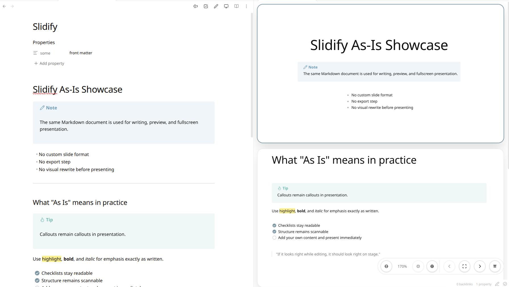
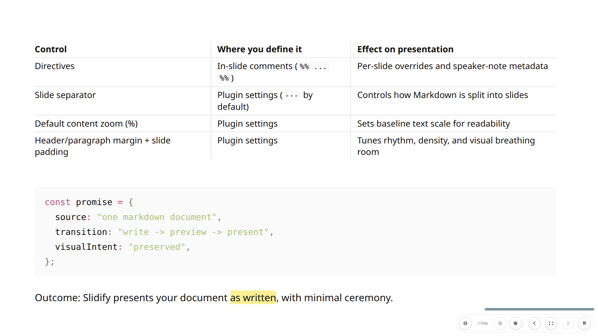

# Slidify

Slidify is a live slide workspace for Obsidian Markdown.
It keeps authoring and presenting in one flow: write in your note with Obsidian's document look, browse slides in a preview stack, then go fullscreen instantly.

| Editor + preview workspace | Presentation mode |
| --- | --- |
|  |  |

## User Guide

### Why Slidify

- Obsidian-native look: what you edit is what you present.
- Live structure feedback while writing, not after finishing.
- Go from drafting to fullscreen presentation in one click.
- Cursor-synced active slide keeps edit/preview loops fast.

### Core workflow

1. Open a Markdown note.
2. Run **Open preview pane**.
3. Edit as usual; the active slide follows your cursor.
4. Run **Toggle presentation mode** when you are ready.

### Available interactions

#### Preview pane

| Action | Result |
| --- | --- |
| Click a slide | Selects that slide and moves the editor cursor to the corresponding line |
| `→` / `Page Down` | Next slide |
| `←` / `Page Up` | Previous slide |
| `F` | Toggle presentation mode |
| `Ctrl` + scroll up | Zoom in slide content |
| `Ctrl` + scroll down | Zoom out slide content |

#### Presentation mode

| Action | Result |
| --- | --- |
| `→` / `Page Down` | Next slide |
| `←` / `Page Up` | Previous slide |
| `F` | Exit presentation mode |
| Scroll down | Next slide |
| Scroll up | Previous slide |
| `Ctrl` + scroll | Zoom slide content |
| Click on slide content | Jump the editor cursor to the clicked line |

#### Overlay controls

| Control | Result |
| --- | --- |
| **Previous** / **Next** buttons | Navigate one slide at a time |
| **−** / **%** / **+** zoom buttons | Zoom out / reset zoom / zoom in slide content |
| **Present** button | toggle preview/presentation mode |
| **Dock** button | Toggle control bar position between left and right |

### Commands

- `Open preview pane`
- `Refresh preview pane`
- `Toggle presentation mode`

### Slide model

- Slides are split by a separator line (default: `---`).
- YAML frontmatter is ignored before slide parsing.
- Layout is classified from the first heading in each slide:
	- `# ...` -> hero
	- `## ...` and below -> section
	- no heading -> content

### Slide directives

Leading `%% ... %%` comment blocks can define per-slide directives.

Supported today:

- `80%` / `125%`: per-slide content scale
- `theme: dark` (parsed into slide metadata)
- `note: ...` (parsed into speaker-notes metadata)

Notes:

- Directives are parsed only from leading comment blocks in each slide.
- Theme/notes are currently stored as metadata for upcoming UI features.

### Settings

- `Slide separator`
- `Default content zoom (%)`
- `Header margin (em)`
- `Paragraph margin (em)`
- `Slide padding (px)`

Advanced refresh:

- `Enable periodic self-healing refresh`
- `Periodic refresh interval (ms)`
- `Resize settle refresh count`
- `Resize settle interval (ms)`

Aspect ratio source order:

1. Monitor ratio (`screen.width / screen.height`)
2. Window ratio
3. `16:9` fallback

## Developer Guide

### Project overview

- TypeScript-based Obsidian community plugin bundled to `main.js`.
- Entry point: `src/main.ts`.
- Core slide view orchestration: `src/slidesPreviewView.ts`.

### Source layout

- `src/slideModel.ts`: slide parsing, layout classification, directive parsing, slide metadata.
- `src/slidesPreview/layoutEngine.ts`: layout measurement and geometry.
- `src/slidesPreview/modeRenderers.ts`: preview/presentation rendering orchestration.
- `src/slidesPreview/interactionController.ts`: keyboard/wheel/fullscreen/resize interaction wiring.
- `src/slidesPreview/icons.ts`: safe SVG icon creation.

### Development

```bash
npm install
npm run dev
```

### Quality checks

```bash
npm run build
npm run lint
```

### Manual install for local testing

After building, copy `main.js`, `manifest.json`, and `styles.css` to:

`<Vault>/.obsidian/plugins/<plugin-id>/`
